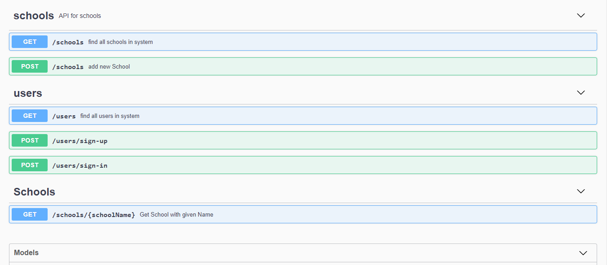

# Backend Application: 

## Project Runing :
---
This project was generated with NPM CLI.

### install dependencies: 
Run `npm install` to install all needed dependencies included in the package.json dependencies.

### Run Application:
Run `npm start ` for a dev server. Navigate to `http://localhost:5000/`. The app will automatically reload if you change any of the source files.

***To get access to swagger documentation refer to the endpoint http://localhost:5000/api-docs***
 
### Swagger Interface
       
