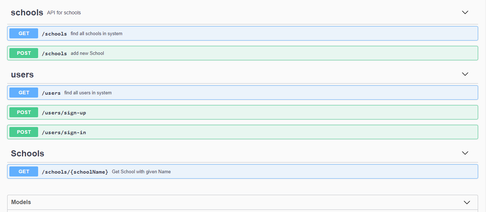
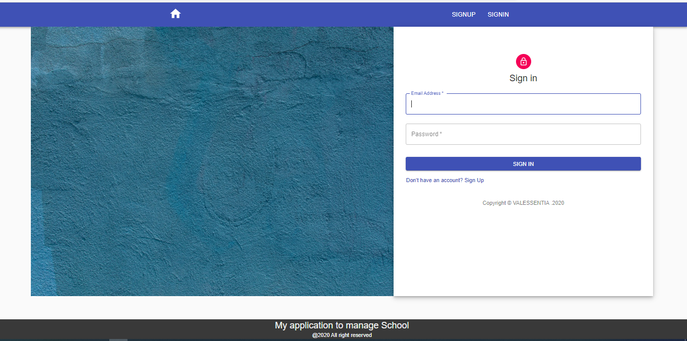
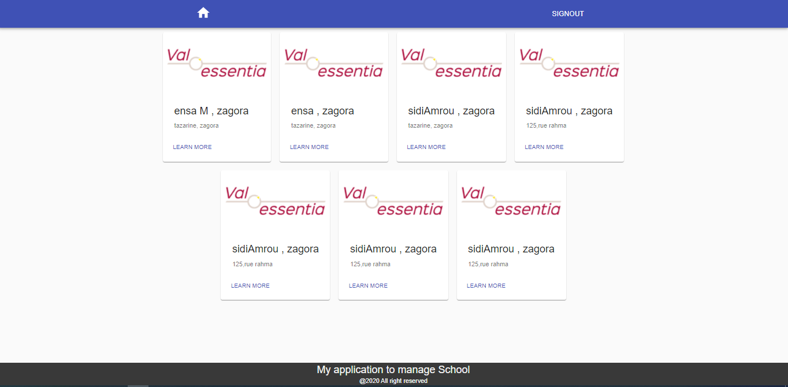
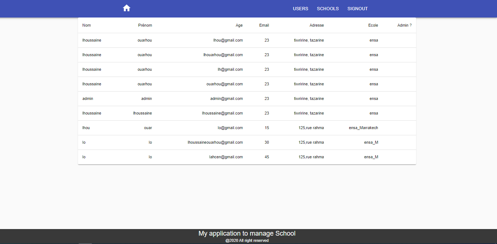
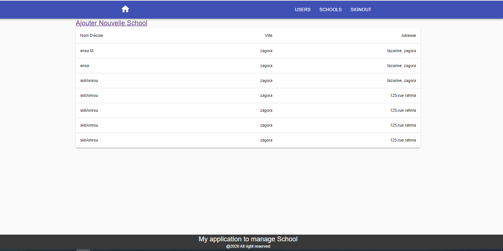

# Test-MERN
## Analysis and microservices development  

In this section I will cover all development needs, and some results of development of my application :
  `To read more about every service configs, installtion, runing refer to it's readme.md file`
### Architecture:
My demo application is composed of backend and frontend applications developped with MERN Stack technologies.

  application  | Details
  ------------- | -------------
  **Backend application**: | Developed using **NodeJS/EpressJS/** and **MongoDB** to persist my schools and users.   
  **Frontend application** | Developed using **Javascript/ReactJS/Redux** and **react material UI** for application styles.

## fonctional analyse and sequence :

to realise this projet in a goog way, I firtly begin with a functional analysis. within  this ,I define the main process of user interaction with the application. 

### Results :
I could explore results of the developpment of the application by consulting the frontend resulting application or by consulting swagger interface of the backend : 
1. Backend swagger interface :
       
2.   Frontend Application results :
  We present bellow the app frontend interface :
  - Sign up to application Page :
      
  - Sign In to applicaption page interface :
   
  - Home page (accessed by all users ) :
   
  - Users Dashboard accessed by admin :
   
  - Schools Dashboard accessed by admin :
   